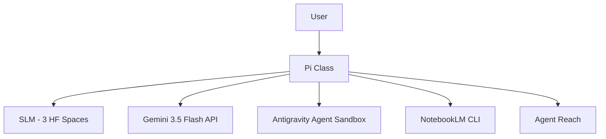

# Pi Agent — SLM Orchestrator

Multi-layer AI orchestration system. 4 compute layers: SLM (HF Spaces), Gemini API + Antigravity Agent, NotebookLM, Agent Reach.

## Quick Start

```bash
# 1. Clone & enter
git clone <repo-url> pi-agent
cd pi-agent

# 2. Set API keys
cp .env.example .env
# Edit .env with your Gemini API keys

# 3. Install dependencies
pip install -r requirements.txt

# 4. Verify
python3 -c "from orchestrator import Pi; pi = Pi(); print(pi.health())"
```

## Architecture



## Layer Guide

| Layer | Tool | Latency | Cost |
|-------|------|---------|------|
| SLM | 9 models on HF Spaces | 2-37s | Free |
| Gemini | 3.5 Flash + code exec | 2-8s | Free tier |
| Antigravity | Linux sandbox | 10-60s | Free preview |
| NotebookLM | Research + artifacts | 5-45m | Free |
| Agent Reach | 15 web platforms | Instant | Free |

## Files

| File | Role |
|------|------|
| `orchestrator.py` | Pi class — all layers |
| `antigravity.py` | Gemini 3.5 Flash + Antigravity Agent |
| `state.py` | SQLite state persistence |
| `eval.py` | Systematic benchmark engine |
| `research.py` | NotebookLM CLI wrapper |
| `spaces/` | HF Space Dockerfiles |
| `.env.example` | Template for secrets |
